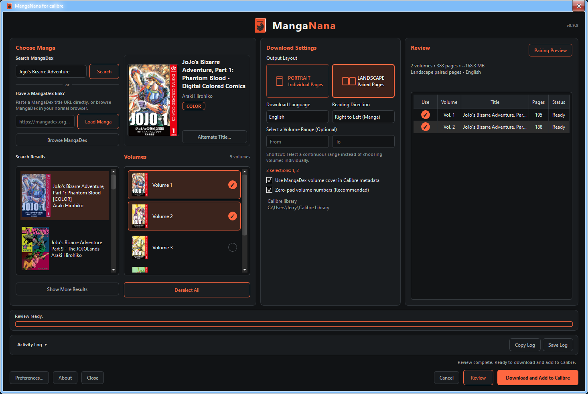
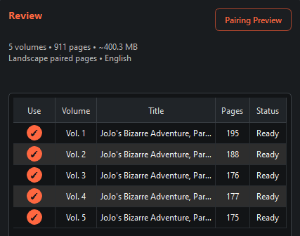
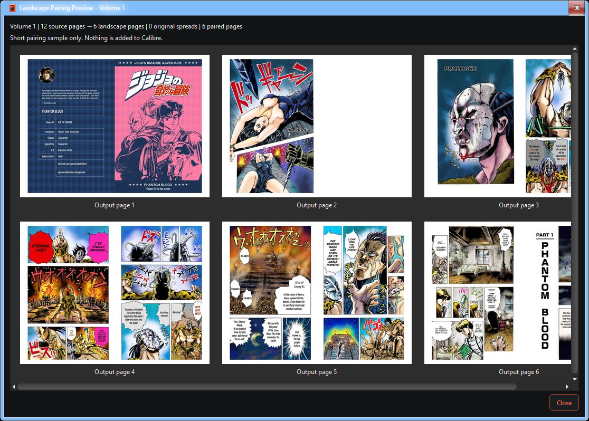

  

<h1 align="center">MangaNana</h1>

 A calibre plugin to search MangaDex, download manga volumes, and create eReader-ready CBZ files with metadata, covers, and landscape paired-page support.

  
  
  

  

## Overview

MangaNana is a calibre plugin designed to make finding, preparing, and adding manga from MangaDex easier.

It combines MangaDex search, volume selection, metadata, covers, language handling, CBZ creation, and page-layout preparation into one workflow.

Search → Select volumes → Choose your reading format → Download & Add

## Features

* Search MangaDex directly from calibre
* Paste MangaDex title links manually
* Select individual volumes or a continuous volume range
* Support standalone chapters when MangaDex does not assign formal volume numbers
* Automatic metadata and cover handling
* Portrait page output
* Landscape paired-page output
* Pairing Preview for checking landscape page behavior
* Review page counts and estimated file sizes before downloading
* eReader-friendly CBZ preparation
* Add completed manga directly to calibre
* Activity Log with download progress and troubleshooting information

## Review Before Downloading

MangaNana provides a review step before the final download begins.

The Review panel can show:

* Selected volumes
* Planned page count
* Estimated file size
* Output layout
* Download language
* Download status

Once the current selection has been reviewed, MangaNana enables **Download and Add to calibre**.

## Pairing Preview

Landscape mode can combine individual manga pages into paired landscape pages.

The Pairing Preview downloads only a small sample from the beginning of a selected volume so you can inspect the resulting layout without downloading the entire book first.

This is especially useful for checking spreads, page order, and paired-page behavior before creating the final CBZ.

## Volume Selection

MangaNana supports several ways to choose what to download.

You can:

* Select individual volumes
* Select multiple non-contiguous volumes
* Enter an optional continuous volume range
* Select the entire available series
* Download standalone chapters when a MangaDex title does not use formal volume numbering

Volume covers are used when available. If a volume does not have its own cover, MangaNana can fall back to the main manga cover.

## Languages

MangaNana checks which download languages are actually available for the selected title.

If your preferred language is unavailable, MangaNana can automatically switch to an available language instead of leaving the title unusable.

Metadata title language and download language are handled separately.

## Download

Download the latest beta from the **Releases** section of this repository.

Current public beta: **v0.9.8**

> [!NOTE]
> MangaNana is currently beta software. Testing across different operating systems, calibre versions, display scaling settings, eReaders, and MangaDex titles is appreciated.

## Installation

1. Download the latest MangaNana plugin ZIP from GitHub Releases.
2. Open calibre.
3. Go to **Preferences → Plugins**.
4. Select **Load plugin from file**.
5. Choose the MangaNana ZIP.
6. Restart calibre when prompted.

Do NOT extract the plugin ZIP before installing it through calibre.

## Basic Workflow

1. Open MangaNana from the calibre toolbar.
2. Search MangaDex or paste a MangaDex title URL.
3. Select a manga.
4. Choose the download language and output layout.
5. Select one or more volumes.
6. Choose **Review**.
7. Check the planned download in the Review panel.
8. Choose **Download and Add to calibre**.
9. MangaNana prepares the CBZ files and adds them to your calibre library.

## Reporting Bugs

Please use GitHub Issues when reporting unexpected behavior.

Include as much of the following information as possible:

* MangaNana version
* calibre version
* Operating system
* Display scaling percentage, if the problem is visual
* MangaDex title or URL
* Download language
* Portrait or Landscape mode
* Steps needed to reproduce the problem
* Activity Log output
* Screenshot when relevant

The Activity Log can be copied directly from MangaNana.

## Current Scope

MangaNana currently uses MangaDex as its manga source and calibre as its library integration.

Possible future directions include support for additional manga sources, a standalone MangaNana application, local manga library management, and direct eReader transfer without requiring calibre.

## License

MangaNana is released under the MIT License.
